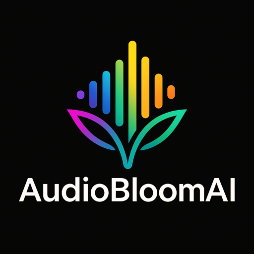

# AudioBloomAI

  

  <strong>AI-powered audio visualizer and VJ studio for macOS.</strong>

  <a href="https://testflight.apple.com/join/AyHQBwgR">Join TestFlight</a>
  ·
  <a href="https://noktirnal42.github.io/AudioBloom/">Website</a>
  ·
  <a href="https://noktirnal42.github.io/AudioBloom/support/">Support</a>
  ·
  <a href="https://noktirnal42.github.io/AudioBloom/privacy/">Privacy</a>
  ·
  <a href="https://github.com/noktirnal42/AudioBloom/wiki">Wiki</a>

AudioBloomAI is a native macOS visualizer for DJs, VJs, projection artists,
streamers, and live music spaces. It captures microphone/interface audio,
system audio, or a single running app, then turns the signal into reactive
Milkdrop/projectM visuals for clean output windows, projector workflows, and
Syphon-capable VJ tools.

This public repository intentionally contains only public materials:

- GitHub Pages website content
- support and privacy pages
- public product documentation
- issue templates
- commercial license notice
- wiki-facing project information

The application source code, build scripts, internal planning notes, model
experiments, signing assets, and release engineering documents are private and
are not published in this repository.

## Try AudioBloomAI

The first 100 testers can try AudioBloomAI free on TestFlight:

[Join the AudioBloomAI TestFlight](https://testflight.apple.com/join/AyHQBwgR)

The App Store link on the website currently points to Apple's App Store landing
page and will be replaced with the product link after approval.

## What It Does

- Reactive Milkdrop/projectM visual output for live music.
- Microphone/interface, system audio, and single-app audio capture.
- Preset search, favorites, ratings, history, setlists, auto-advance, and Deck B
  staging.
- Clean output, projector output, and Syphon publishing for VJ workflows.
- Optional camera texture layer and local experimental audio-semantics controls.

## Public Documentation

- [Website](https://noktirnal42.github.io/AudioBloom/)
- [Getting Started](https://noktirnal42.github.io/AudioBloom/getting-started/)
- [Renderers and Presets](https://noktirnal42.github.io/AudioBloom/renderers-and-presets/)
- [Integrations](https://noktirnal42.github.io/AudioBloom/integrations/)
- [Support](https://noktirnal42.github.io/AudioBloom/support/)
- [Privacy Policy](https://noktirnal42.github.io/AudioBloom/privacy/)
- [Roadmap](https://noktirnal42.github.io/AudioBloom/roadmap/)
- [Wiki](https://github.com/noktirnal42/AudioBloom/wiki)

## Support

For setup help, bug reports, and feature requests, use the support page:

[AudioBloomAI Support](https://noktirnal42.github.io/AudioBloom/support/)

Please do not post private audio, screenshots, logs, credentials, or personal
information in public issues.

## License

AudioBloomAI is commercial closed-source software. This repository's public
documents are provided for product support and informational use only.

See [LICENSE](LICENSE).
